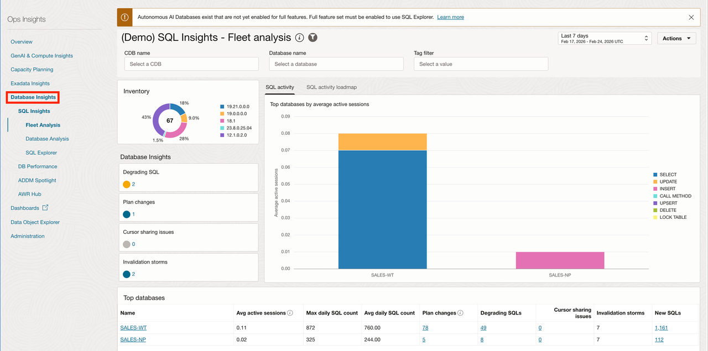
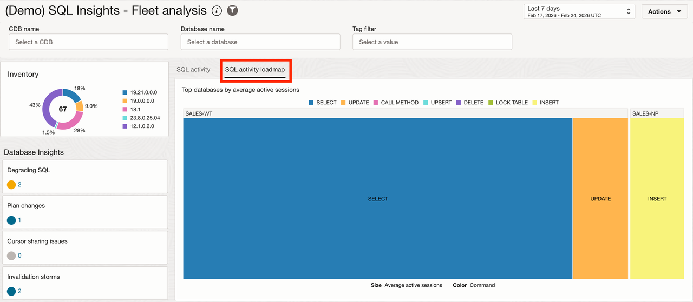
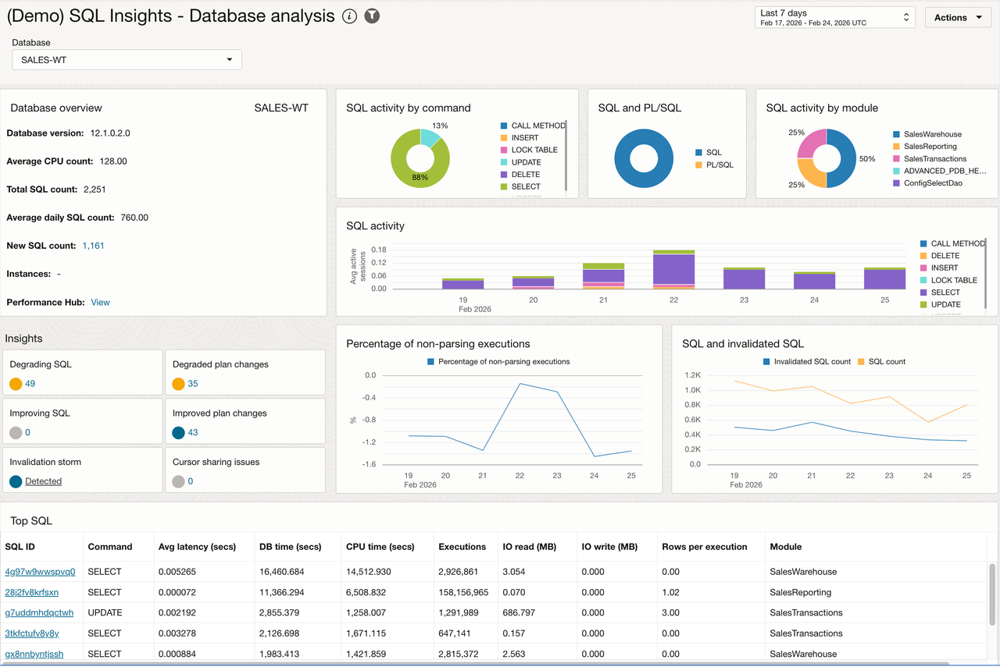
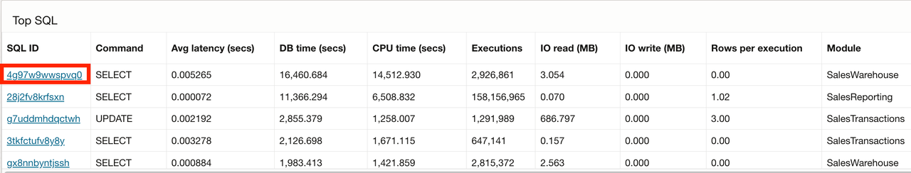

# Task 7: Analyze SQL Performance Across the Fleet

SQL Insights extends the investigation beyond one database. They help you determine whether SQL degradation, plan changes, inefficiency, or resource consumption is isolated or repeated across databases and environments.

SQL Insights provides fleet analysis, an activity loadmap, database analysis, and SQL analysis. The feature provides powerful insights into overall application perform and workload type against the database. You will quickly assess the overall health of your database SQL executions and find outliers or problematic statements across your fleet. Utilizing these performance details, you can be more proactive in the management of your SQL performance across environments and compare like-to-like database environments on the application-code level.

1. In Ops Insights, open **Database Insights → SQL Insights → Fleet Analysis**.
    
2. Review the SQL activity loadmap and the available insights for degrading SQL, unpredictable performance, inefficiency, changing execution plans, and top CPU or I/O usage.
    
3. Open database analysis for the selected database, when available.
    
4. Review total time by command or module, SQL/PL/SQL time, insight counts, workload activity, execute-to-parse ratio, SQL count, and invalidations.
5. Open SQL analysis for the DBM SQL ID, when available. If it is not present, select a high-impact SQL statement with a related performance pattern.
    
6. Review average latency, execution frequency, daily database time, I/O, plans, and resource usage.

If time permits, open **SQL Insights → SQL Explorer**:

1. In basic mode, run a validated workshop query that aggregates a resource such as CPU time by database and SQL ID, sorts by descending resource use, and limits the result set.
2. Display the result as a stacked bar chart using database name, SQL ID, and the selected aggregate metric.
3. Clear the query and run a second validated fleet query, such as elapsed time by database and SQL ID.
4. Open **Advanced** mode and use the help icon to inspect available views, columns, and sample queries.
5. Modify one filter or grouping and rerun the visualization.

Record:

- SQL Insights category: `[category]`
- Databases or environments affected: `[scope]`
- Plan or trend observation: `[observation]`
- Is the issue isolated or systemic? `[classification]`
- SQL Explorer visualization, if used: `[visualization]`
