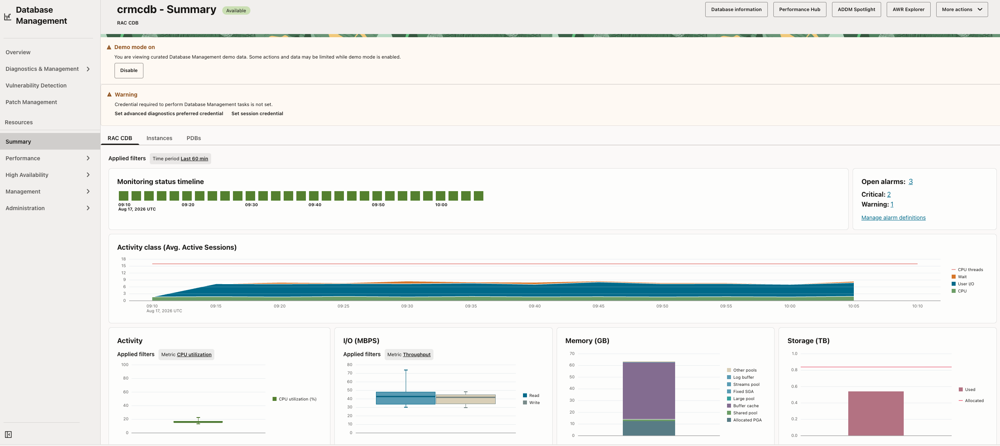
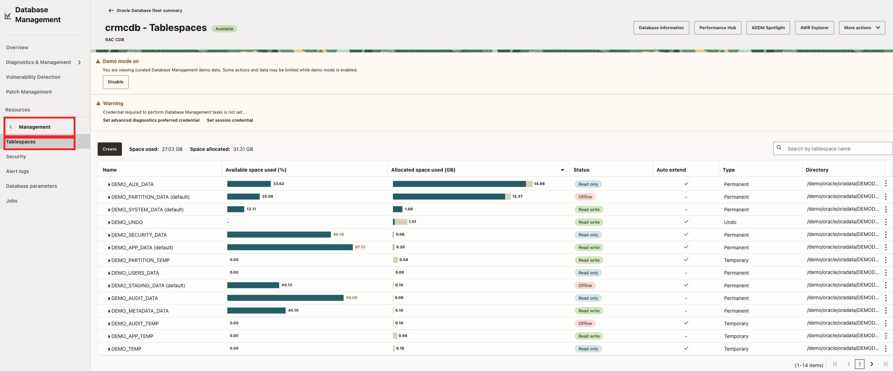
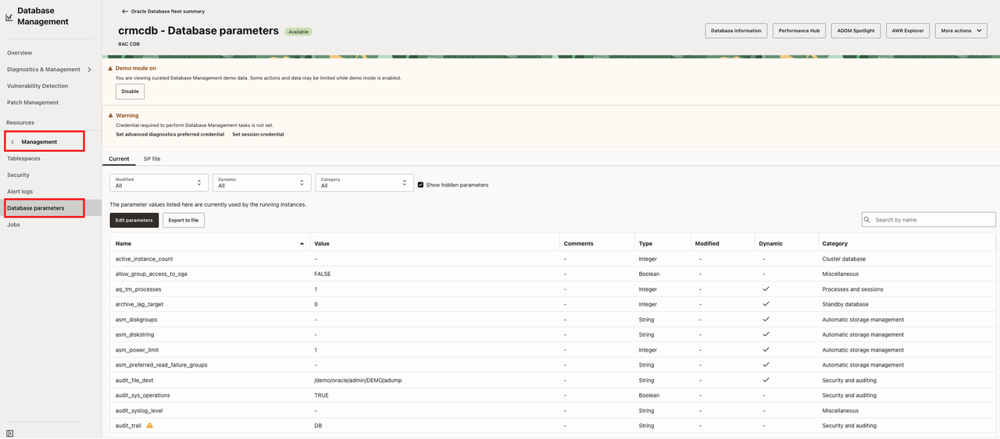
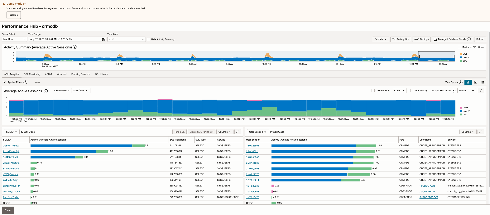
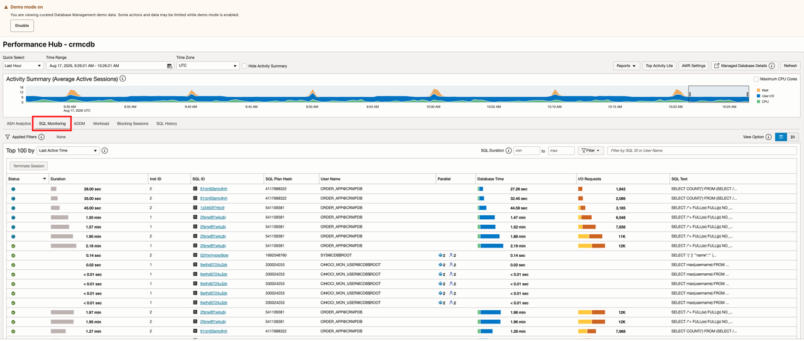
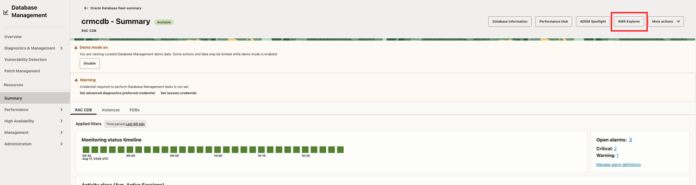
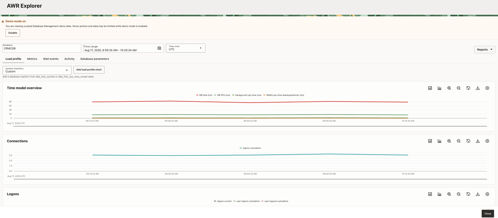
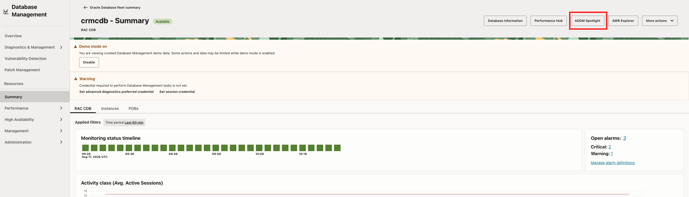
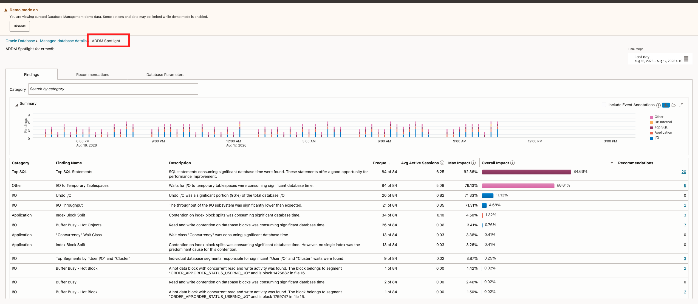

# Module 2 – OCI Database Management Service

## Introduction

Investigate a sample database using current and historical performance data. Use database metrics, SQL execution details, and recommendations to identify likely performance issues.

### Objectives

- Review database availability, activity, and resource usage.
- Investigate workload and SQL execution using Performance Hub and SQL Monitoring.
- Explore historical trends with AWR Explorer.
- Review ADDM Spotlight findings and recommendations to refine your diagnosis.

### Prerequisites

- An OCI account with access to Database Management.
- Database Management Demo Mode enabled through **Database Management → Overview**.

## Task 3: Investigate the Managed Database

From Fleet Summary, you can drill down into an individual database resource to investigate performance, configuration, and overall health. The resource view provides current performance information together with access to real-time and historical analysis tools.

Reviewing the availability timeline, activity classes, CPU, I/O, memory, and storage helps you determine whether the signal is a short spike, sustained trend, or availability issue. In Demo Mode, resource pages such as Tablespaces and Database Parameters may contain curated sample data. You can explore the workflows, but changes are not expected to persist.

1. From Fleet Summary, open the selected managed database.
    
2. Review the monitoring charts for the selected time period.
3. Compare the **Availability timeline**, **Activity Class**, **Activity**, **I/O**, **Memory**, and **Storage Usage** views.
    
4. Note whether the signal is a short spike, a sustained trend, or an availability interruption.
5. If the target is a RAC CDB/PDB, verify the database level and member context before comparing metrics.
6. Explore the available resource pages in the left navigation, such as **Tablespaces** and **Database Parameters**, when they are populated.

    

    

Record:

- Database and level: `[CDB, PDB, RAC, or other]`
- Leading signal: `[CPU, I/O, memory, storage, activity, availability, or other]`
- Time range: `[time range]`
- Supporting chart or alarm: `[evidence]`
- Initial hypothesis: `[workload/resource/availability/insufficient evidence]`

**Checkpoint:** State whether the database-level evidence points primarily to workload, SQL, resource, availability, or insufficient evidence.

## Task 4: Explore Performance Hub and SQL Monitoring

Performance Hub provides a consolidated view of database performance. Its workload-sensitive charts and metrics help you analyze database activity across different periods and drill into SQL execution statistics.

Use workload and session details to understand active database activity and identify high-impact or resource-intensive SQL statements. SQL Monitoring provides execution-level details such as elapsed time, CPU usage, I/O activity, execution progress, and execution-plan behavior.

1. On the managed database details page, click **Performance Hub**.
    
2. Set the time range to the period containing the signal.
3. Review workload-sensitive charts and compare activity classes or wait classes.
4. Use workload and session views to identify a high-impact SQL statement, wait class, or session pattern.
    
5. Open **SQL Monitoring**, when populated, and select a SQL ID.
    
6. Review execution duration, CPU, I/O, execution progress, and the execution plan.
    
7. Compare plans when multiple plans are available.
8. Note whether the evidence is consistent with CPU pressure, I/O pressure, a wait-class concentration, a plan change, or a recurring workload pattern.

Record:

- Leading signal or wait class: `[signal]`
- SQL ID, if available: `[SQL ID or N/A]`
- SQL Monitoring evidence: `[evidence]`
- Execution-plan observation: `[plan evidence]`
- Working diagnosis: `[diagnosis]`

**Checkpoint:** Classify the evidence as primarily a SQL/workload issue, a resource constraint, an availability issue, or insufficient evidence.

You may open actions such as Tune SQL, Create SQL Tuning Set, credential preference, or session credential flows to see how they work. Demo Mode prevents underlying write operations from being committed.

## Task 5: Explore AWR Explorer and ADDM Spotlight

AWR Explorer provides historical database performance analysis across selected and extended time periods. It exposes more granular performance data over longer periods than a single snapshot comparison, helping you identify trends, workload spikes, recurring patterns, SQL outliers, and changes in database behavior.

ADDM analyzes AWR performance snapshots and produces findings about database time, or **DB Time**, together with recommendations that may reduce that time. ADDM Spotlight aggregates findings and recommendations across a longer reporting period instead of presenting only isolated hourly events.

This longer view helps you distinguish chronic problems from intermittent spikes. A finding’s **impact** represents the workload affected by the problem, while a recommendation’s **benefit** represents the potential improvement. Frequency, average active sessions, and maximum impact or benefit help you weigh the value, cost, and implementation risk of a change before recommending additional capacity or SQL tuning.

The ADDM Spotlight summary timeline shows when findings and recommendations occur. Findings and Recommendations views organize the aggregated results by category and support prioritization by impact or benefit. Database Parameters helps identify high-impact parameters, parameters changed during the reporting period, ADDM-recommended changes, and non-default values.

Note: In Ops Insights, the fleet and compartment-oriented ADDM view helps narrow a large result set to the most important performance issues before drilling into a specific database.

1. From the managed database details page, open **AWR Explorer**.
    
2. Set the time range around the observed signal.
3. Compare historical activity and waits with the current Performance Hub evidence.
    
4. Drill-down on a chart to view histogram wait event details.
5. Close the application to go directly back to the database resource page.
6. Open **ADDM Spotlight**.
    
7. Review the database listing, findings count, overall impact, categories, and time-range filters.
8. Review the summary timeline and determine whether the finding or recommendation is recurring or intermittent.
9. Review **Findings** and **Recommendations**, comparing frequency, average active sessions, maximum impact, and recommendation benefit when available.
    
10. Review **Database Parameters** for high-impact parameters, changes during the reporting period, ADDM-recommended changes, and non-default values.
11. Compare the highest-impact finding with the DBM diagnosis.

Record:

- Historical trend or wait: `[trend or N/A]`
- ADDM finding category: `[category or N/A]`
- Frequency or recurring pattern: `[frequency/pattern]`
- Average active sessions or impact: `[value/observation]`
- Maximum impact or recommendation benefit: `[value/observation]`
- Recommendation: `[recommendation or N/A]`
- Updated diagnosis: `[diagnosis]`

**Checkpoint:** Identify one historical finding or recommendation that adds context to the current database signal.

## Acknowledgements

- **Author** - Derik Harlow
- **Contributors** - Sriram Vrinda, Derik Harlow, Kranti Agrawal, Shaickmohamed Sirajudeen
