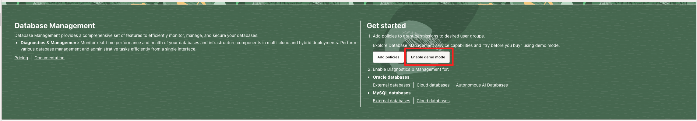
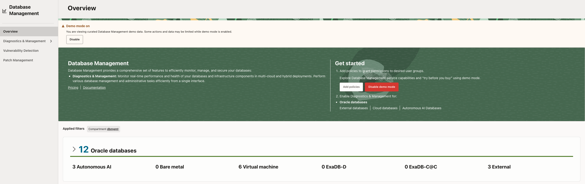

# Task 1: Enable Demo Mode

Demo Mode allows you to explore Database Management and Ops Insights features using sample data without requiring managed database resources or a live workload.

1. Sign in to the OCI Console.
2. Open **Database Management → Overview**.
3. Select **Enable Demo Mode**.
4. Confirm that the DBM Demo Mode banner is visible.

**Checkpoint:** Confirm the service displays the Demo Mode banner and that sample data is available.
