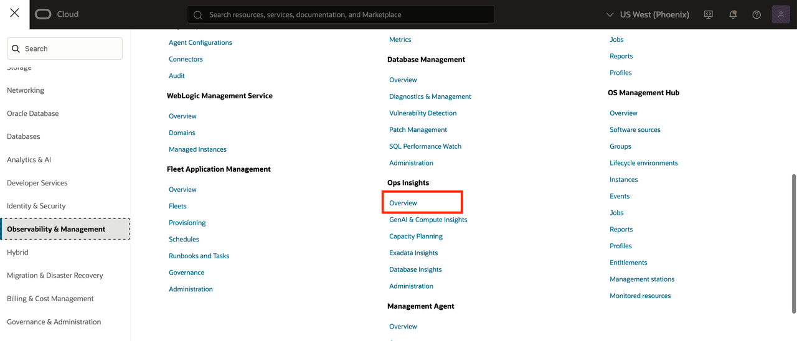
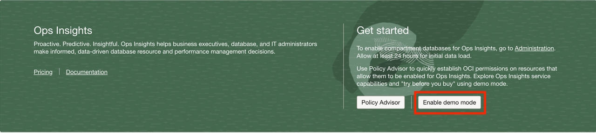
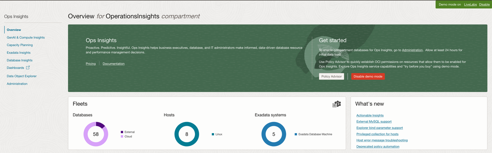

# Task 6: Enable Demo Mode

Enable demo mode for Ops Insights.

1. Open **Ops Insights → Overview**.
    
2. Select **Enable Demo Mode** and complete any displayed policy workflow.
    
3. Confirm that the OPSI Demo Mode banner is visible.
    

**Checkpoint:** Confirm the service displays the Demo Mode banner and that sample data is available.
