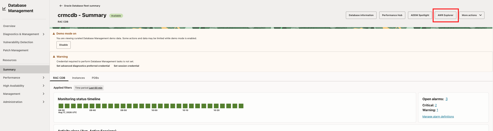
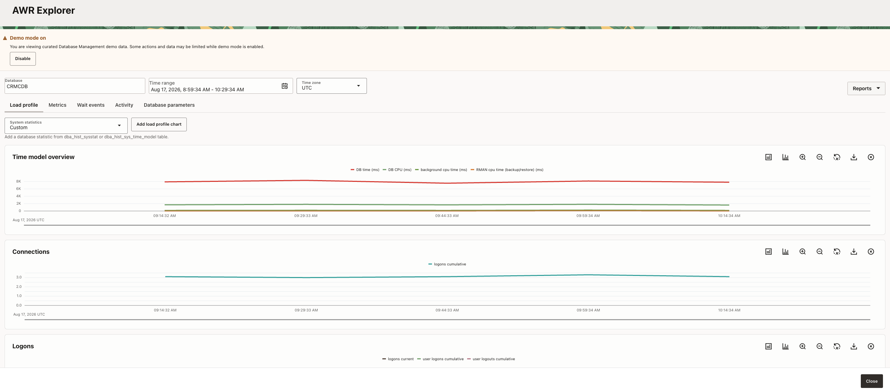

# Task 5: Explore AWR Explorer and ADDM Spotlight

AWR Explorer provides historical database performance analysis across selected and extended time periods. It exposes more granular performance data over longer periods than a single snapshot comparison, helping you identify trends, workload spikes, recurring patterns, SQL outliers, and changes in database behavior.

ADDM analyzes AWR performance snapshots and produces findings about database time, or **DB Time**, together with recommendations that may reduce that time. ADDM Spotlight aggregates findings and recommendations across a longer reporting period instead of presenting only isolated hourly events.

This longer view helps you distinguish chronic problems from intermittent spikes. A finding’s **impact** represents the workload affected by the problem, while a recommendation’s **benefit** represents the potential improvement. Frequency, average active sessions, and maximum impact or benefit help you weigh the value, cost, and implementation risk of a change before recommending additional capacity or SQL tuning.

The ADDM Spotlight summary timeline shows when findings and recommendations occur. Findings and Recommendations views organize the aggregated results by category and support prioritization by impact or benefit. Database Parameters helps identify high-impact parameters, parameters changed during the reporting period, ADDM-recommended changes, and non-default values.

Note: In Ops Insights, the fleet and compartment-oriented ADDM view helps narrow a large result set to the most important performance issues before drilling into a specific database.

1. From the managed database details page, open **AWR Explorer**.
    
2. Set the time range around the observed signal.
3. Compare historical activity and waits with the current Performance Hub evidence.
    
4. Drill-down on a chart to view histogram wait event details.
5. Close the application to go directly back to the database resource page.
6. Open **ADDM Spotlight**.
    
7. Review the database listing, findings count, overall impact, categories, and time-range filters.
8. Review the summary timeline and determine whether the finding or recommendation is recurring or intermittent.
9. Review **Findings** and **Recommendations**, comparing frequency, average active sessions, maximum impact, and recommendation benefit when available.
    
10. Review **Database Parameters** for high-impact parameters, changes during the reporting period, ADDM-recommended changes, and non-default values.
11. Compare the highest-impact finding with the DBM diagnosis.

Record:

- Historical trend or wait: `[trend or N/A]`
- ADDM finding category: `[category or N/A]`
- Frequency or recurring pattern: `[frequency/pattern]`
- Average active sessions or impact: `[value/observation]`
- Maximum impact or recommendation benefit: `[value/observation]`
- Recommendation: `[recommendation or N/A]`
- Updated diagnosis: `[diagnosis]`

**Checkpoint:** Identify one historical finding or recommendation that adds context to the current database signal.
