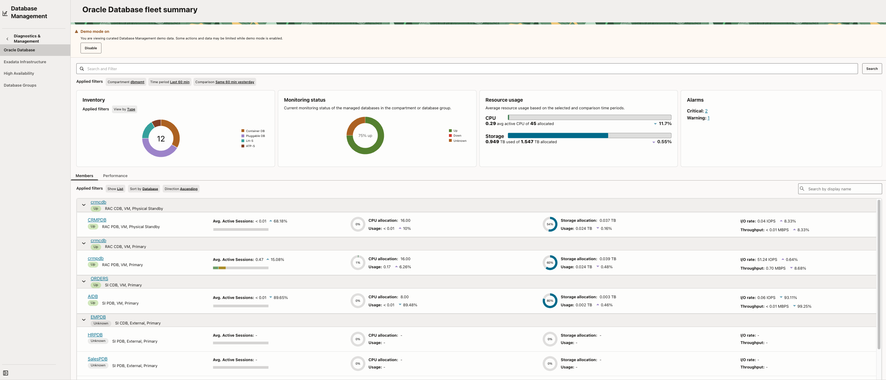
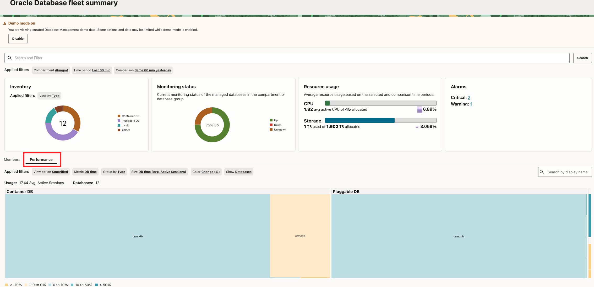

# Task 2: Explore DBM Fleet Summary

Fleet Summary is the landing page for Database Management. It provides a unified view of database health, monitoring status, resource utilization, and alarms so that you can quickly identify which databases require attention.

The **database inventory** shows the number and types of databases in the environment. **Monitoring Status** shows whether databases are up and being monitored. **Resource Usage** provides a fleet-level view of CPU and storage utilization, while **Alarms** highlights active critical and warning conditions.

The **Members** section lists each database with metrics such as Average Active Sessions, CPU usage, storage utilization, I/O rate, and throughput. The **Performance** treemap compares databases visually: rectangle size represents the selected metric and color represents the percentage change during the selected period. This makes it easier to identify a performance or capacity hotspot in a large fleet.

1. In DBM, open **Diagnostics and Management → Oracle Database → Fleet Summary**.
    
2. Review the database inventory and monitoring status.
    
3. Review the **Resource Usage** and **Alarms** panels.
4. In **Members**, compare several databases using the metrics that are populated in the environment.
5. Use the **Performance** treemap to identify a database that deserves investigation.
    
6. Select **CRMCDB** when it is present and populated. Otherwise, select a member with populated charts and an observable signal.

Record:

- Selected database: `[database name]`
- Signal or alarm: `[signal]`
- Alarm severity or resource concern: `[severity or N/A]`
- Most important metric: `[metric]`

**Checkpoint:** Explain why the selected database is a better investigation target than a database with no visible signal.
