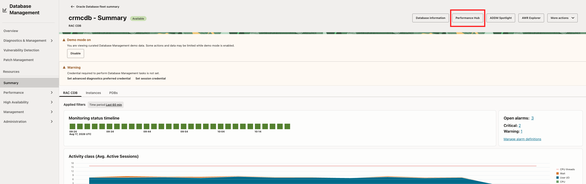
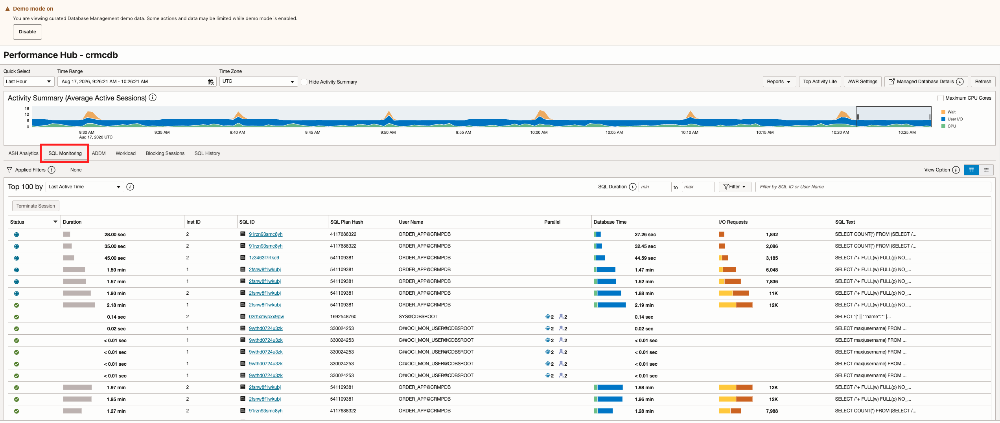
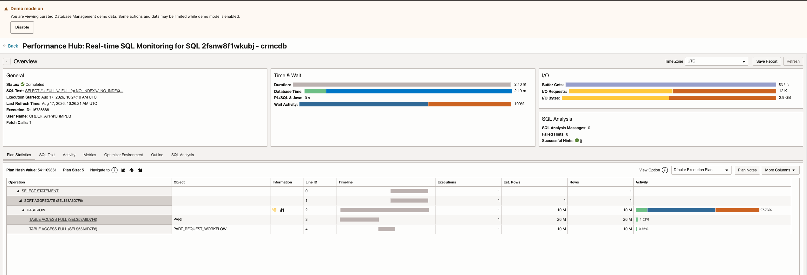

# Task 4: Explore Performance Hub and SQL Monitoring

Performance Hub provides a consolidated view of database performance. Its workload-sensitive charts and metrics help you analyze database activity across different periods and drill into SQL execution statistics.

Use workload and session details to understand active database activity and identify high-impact or resource-intensive SQL statements. SQL Monitoring provides execution-level details such as elapsed time, CPU usage, I/O activity, execution progress, and execution-plan behavior.

1. On the managed database details page, click **Performance Hub**.
    
2. Set the time range to the period containing the signal.
3. Review workload-sensitive charts and compare activity classes or wait classes.
4. Use workload and session views to identify a high-impact SQL statement, wait class, or session pattern.
    
5. Open **SQL Monitoring**, when populated, and select a SQL ID.
    
6. Review execution duration, CPU, I/O, execution progress, and the execution plan.
    
7. Compare plans when multiple plans are available.
8. Note whether the evidence is consistent with CPU pressure, I/O pressure, a wait-class concentration, a plan change, or a recurring workload pattern.

Record:

- Leading signal or wait class: `[signal]`
- SQL ID, if available: `[SQL ID or N/A]`
- SQL Monitoring evidence: `[evidence]`
- Execution-plan observation: `[plan evidence]`
- Working diagnosis: `[diagnosis]`

**Checkpoint:** Classify the evidence as primarily a SQL/workload issue, a resource constraint, an availability issue, or insufficient evidence.

You may open actions such as Tune SQL, Create SQL Tuning Set, credential preference, or session credential flows to see how they work. Demo Mode prevents underlying write operations from being committed.
