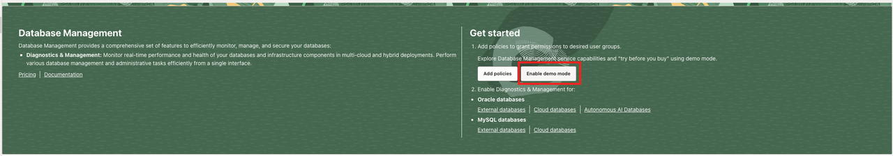
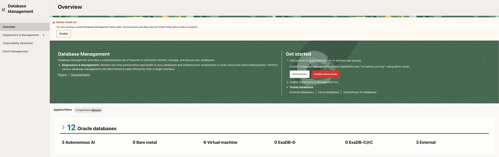
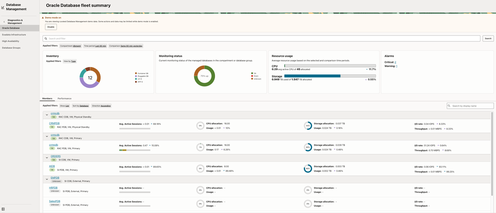
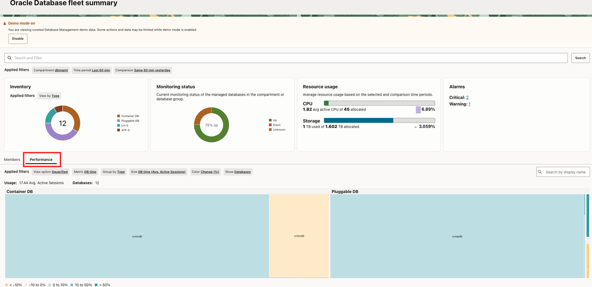

# Lab 1: Assess Fleet Health and Select a Database

## Introduction

Start with a fleet-level view. Enable curated Demo Mode data, review Database Management health signals, and choose one populated database for deeper investigation. The goal is to select an evidence-backed target, not to find a particular database name or fixed metric value.

### Objectives

In this lab, you will:

- Enable Database Management Demo Mode.
- Review inventory, monitoring status, resource usage, alarms, and member metrics.
- Select a database with a visible signal and record the baseline evidence.

Estimated Time: 20 minutes

## Task 1: Enable Database Management Demo Mode

Demo Mode lets you explore Database Management workflows with curated sample data. It does not require a managed database or a live workload.

1. Sign in to the OCI Console.
2. Open **Database Management** and select **Overview**.
3. Select **Enable Demo Mode**.
    
4. Confirm that the Database Management Demo Mode banner is visible.
    
5. Confirm that sample data is available before continuing.

**Checkpoint:** The service shows the Demo Mode banner and at least one populated view.

## Task 2: Explore DBM Fleet Summary

Fleet Summary combines inventory, monitoring status, resource usage, alarms, member metrics, and a performance treemap. Use it to identify a database that warrants investigation.

1. Open **Diagnostics and Management → Oracle Database → Fleet Summary**.
    
2. Review the database inventory and monitoring status.
    
3. Review the **Resource Usage** and **Alarms** panels.
4. In **Members**, compare several databases using metrics populated in the current environment, such as Average Active Sessions, CPU, storage utilization, I/O rate, or throughput.
5. Use the **Performance** treemap to identify a performance or capacity hotspot. Rectangle size represents the selected metric, while color represents the change during the selected period.
6. Select **CRMCDB** when it is present and populated. Otherwise, select a member with populated charts and an observable signal.

Record the following values from the current environment:

- Selected database: `[database name]`
- Signal or alarm: `[signal]`
- Alarm severity or resource concern: `[severity or N/A]`
- Most important metric: `[metric]`

**Checkpoint:** Explain why the selected database is a better investigation target than a database with no visible signal.

## Acknowledgements

* **Source approval** - The workshop author confirmed approval to use the provided source material for this build. Built with permission from the author(s).
* **Author** - Workshop owner to be assigned
* **Last Updated By/Date** - 2026-09-14
