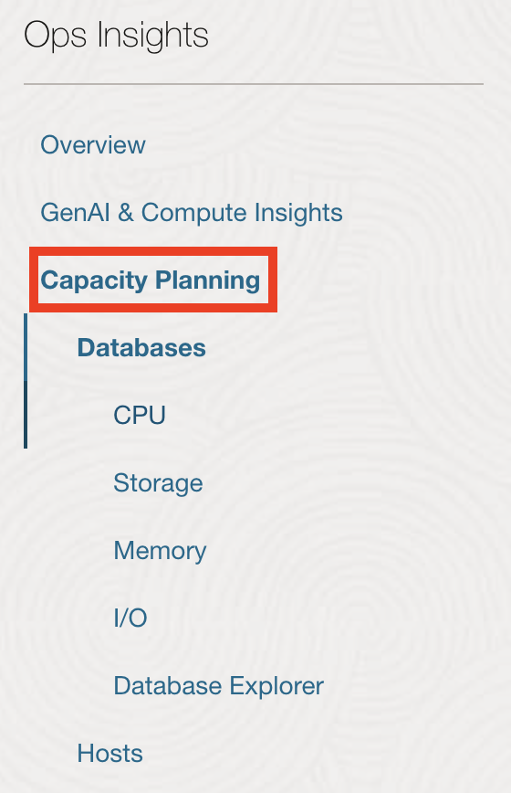
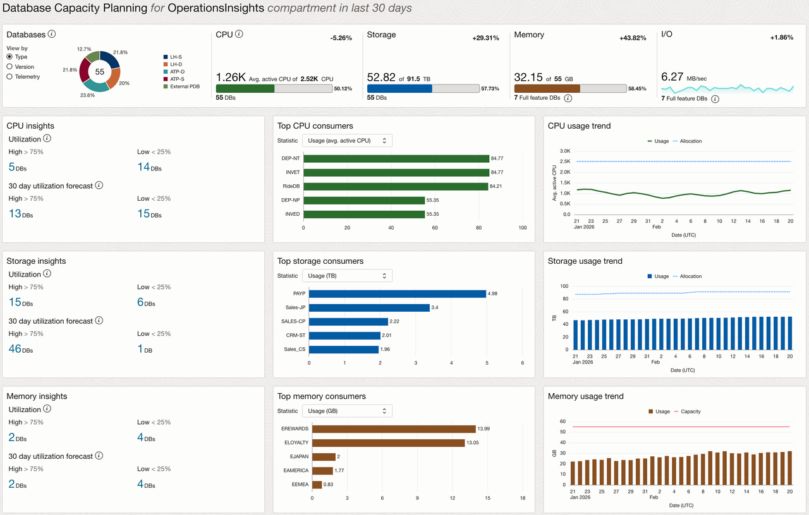
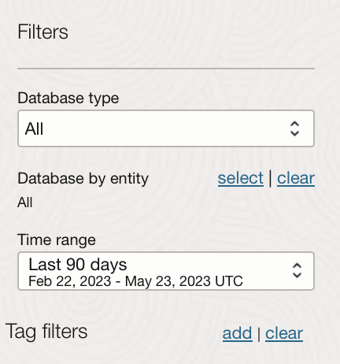
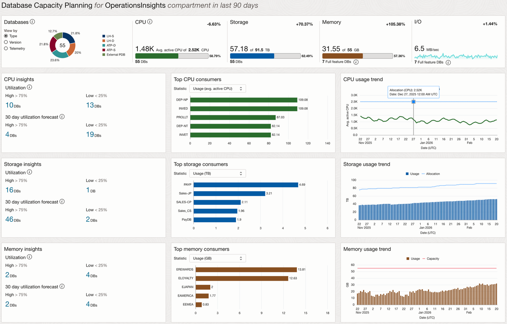
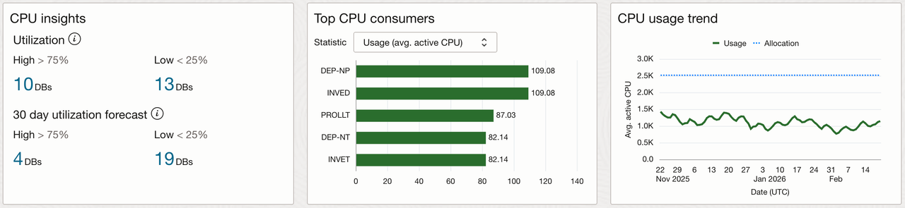
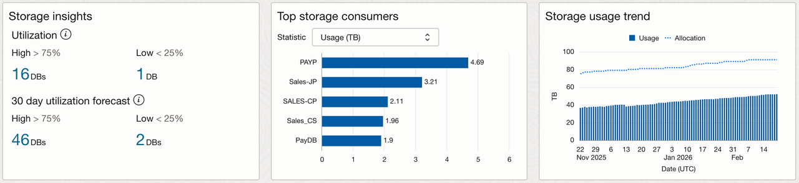

# Task 8: Forecast Database Capacity

Capacity Planning provides a longer-term view of resource allocation, utilization, growth, unused capacity, and forecast demand. This helps you decide whether the DBM signal needs immediate tuning, additional capacity, reclamation, autoscaling, or continued monitoring.

1. Open **Ops Insights → Capacity Planning → Oracle Databases**.
    
    
2. Set **Time Range** to **Last 90 days**, when available.
    
3. Review database inventory and aggregate allocation/utilization for CPU, storage, memory, and I/O.
    
4. Review top consumers and growth views for CPU, storage, and memory.
5. Apply database type or tag filters when they help isolate the affected fleet segment.
6. Open **CPU → Insights** and review the 30-day high-utilization forecast.
    
7. Select a populated database or group for a focused trend and forecast view.
8. Compare average usage, maximum usage, allocation, utilization, and usage change.
9. Compare the available linear regression, seasonality-aware, and AutoML forecast views. Record the training period and confidence interval when shown.
10. Open **Storage** and check whether unused capacity or the storage forecast changes your recommendation.

    

Record:

- Resource analyzed: `[CPU/storage/memory/I/O]`
- Forecast horizon or time range: `[range]`
- Top consumer or group: `[consumer]`
- Allocation versus usage: `[observation]`
- Forecast model: `[model or N/A]`
- Forecast risk: `[risk]`
- Recommended response: `[action]`

**Checkpoint:** Connect the database-level evidence from DBM to the fleet-level decision in OPSI.
