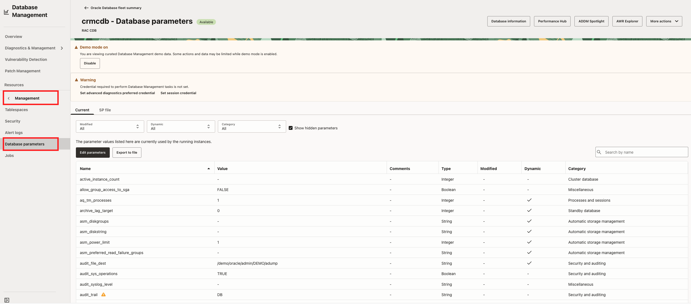

# Task 3: Investigate the Managed Database

From Fleet Summary, you can drill down into an individual database resource to investigate performance, configuration, and overall health. The resource view provides current performance information together with access to real-time and historical analysis tools.

Reviewing the availability timeline, activity classes, CPU, I/O, memory, and storage helps you determine whether the signal is a short spike, sustained trend, or availability issue. In Demo Mode, resource pages such as Tablespaces and Database Parameters may contain curated sample data. You can explore the workflows, but changes are not expected to persist.

1. From Fleet Summary, open the selected managed database.
    
2. Review the monitoring charts for the selected time period.
3. Compare the **Availability timeline**, **Activity Class**, **Activity**, **I/O**, **Memory**, and **Storage Usage** views.
    
4. Note whether the signal is a short spike, a sustained trend, or an availability interruption.
5. If the target is a RAC CDB/PDB, verify the database level and member context before comparing metrics.
6. Explore the available resource pages in the left navigation, such as **Tablespaces** and **Database Parameters**, when they are populated.

    

    

Record:

- Database and level: `[CDB, PDB, RAC, or other]`
- Leading signal: `[CPU, I/O, memory, storage, activity, availability, or other]`
- Time range: `[time range]`
- Supporting chart or alarm: `[evidence]`
- Initial hypothesis: `[workload/resource/availability/insufficient evidence]`

**Checkpoint:** State whether the database-level evidence points primarily to workload, SQL, resource, availability, or insufficient evidence.
