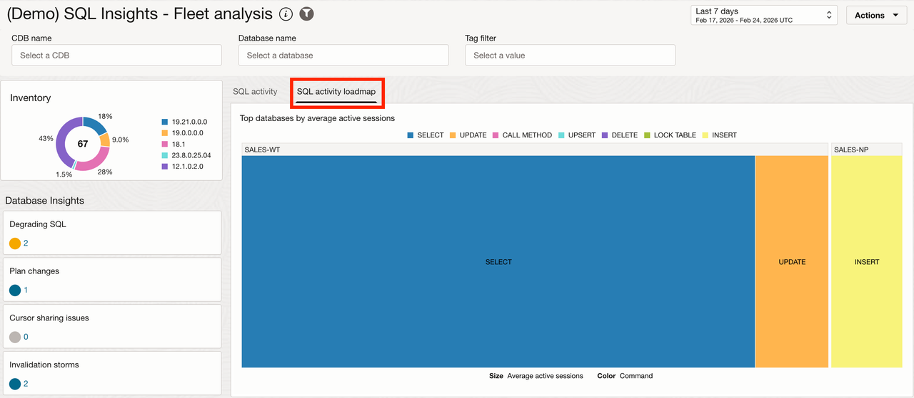
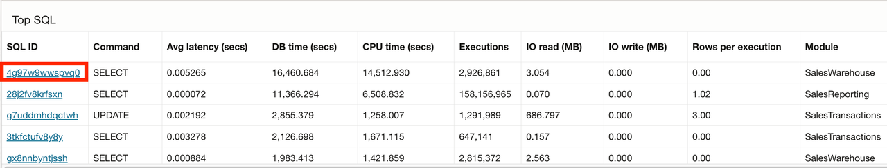
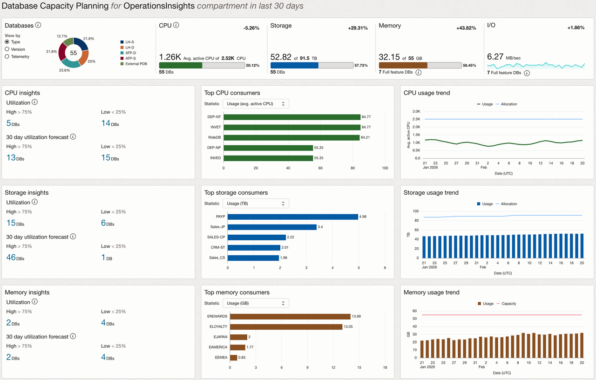
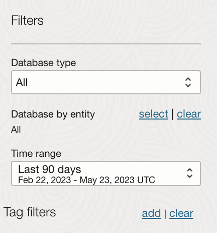
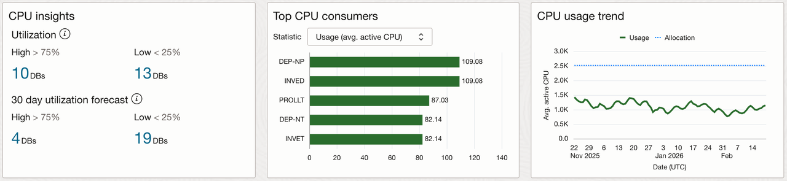
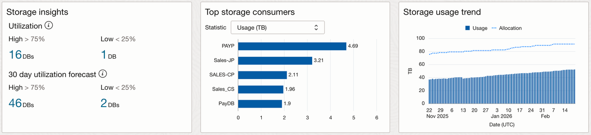

# Module 3 – Ops Insights Service

## Introduction

Use Ops Insights Demo Mode to analyze SQL performance across databases and forecast resource demand. Identify SQL performance patterns and capacity risks that warrant further action.

### Objectives

- Enable Ops Insights Demo Mode.
- Identify SQL degradation, plan changes, and resource-intensive statements across the fleet.
- Compare database resource allocation, utilization, and growth.
- Review capacity forecasts and recommend a next action.

### Prerequisites

- An OCI account and access to the OCI Console.
- Access to Ops Insights and permission to enable Demo Mode.

## Task 6: Enable Demo Mode

Enable demo mode for Ops Insights.

1. Open **Ops Insights → Overview**.
    
2. Select **Enable Demo Mode** and complete any displayed policy workflow.
    
3. Confirm that the OPSI Demo Mode banner is visible.
    

**Checkpoint:** Confirm the service displays the Demo Mode banner and that sample data is available.

## Task 7: Analyze SQL Performance Across the Fleet

SQL Insights extends the investigation beyond one database. They help you determine whether SQL degradation, plan changes, inefficiency, or resource consumption is isolated or repeated across databases and environments.

SQL Insights provides fleet analysis, an activity loadmap, database analysis, and SQL analysis. The feature provides powerful insights into overall application perform and workload type against the database. You will quickly assess the overall health of your database SQL executions and find outliers or problematic statements across your fleet. Utilizing these performance details, you can be more proactive in the management of your SQL performance across environments and compare like-to-like database environments on the application-code level.

1. In Ops Insights, open **Database Insights → SQL Insights → Fleet Analysis**.
    
2. Review the SQL activity loadmap and the available insights for degrading SQL, unpredictable performance, inefficiency, changing execution plans, and top CPU or I/O usage.
    
3. Open database analysis for the selected database, when available.
    
4. Review total time by command or module, SQL/PL/SQL time, insight counts, workload activity, execute-to-parse ratio, SQL count, and invalidations.
5. Open SQL analysis for the DBM SQL ID, when available. If it is not present, select a high-impact SQL statement with a related performance pattern.
    
6. Review average latency, execution frequency, daily database time, I/O, plans, and resource usage.

If time permits, open **SQL Insights → SQL Explorer**:

1. In basic mode, run a validated workshop query that aggregates a resource such as CPU time by database and SQL ID, sorts by descending resource use, and limits the result set.
2. Display the result as a stacked bar chart using database name, SQL ID, and the selected aggregate metric.
3. Clear the query and run a second validated fleet query, such as elapsed time by database and SQL ID.
4. Open **Advanced** mode and use the help icon to inspect available views, columns, and sample queries.
5. Modify one filter or grouping and rerun the visualization.

Record:

- SQL Insights category: `[category]`
- Databases or environments affected: `[scope]`
- Plan or trend observation: `[observation]`
- Is the issue isolated or systemic? `[classification]`
- SQL Explorer visualization, if used: `[visualization]`

## Task 8: Forecast Database Capacity

Capacity Planning provides a longer-term view of resource allocation, utilization, growth, unused capacity, and forecast demand. This helps you decide whether the DBM signal needs immediate tuning, additional capacity, reclamation, autoscaling, or continued monitoring.

1. Open **Ops Insights → Capacity Planning → Oracle Databases**.
    
    
2. Set **Time Range** to **Last 90 days**, when available.
    
3. Review database inventory and aggregate allocation/utilization for CPU, storage, memory, and I/O.
    
4. Review top consumers and growth views for CPU, storage, and memory.
5. Apply database type or tag filters when they help isolate the affected fleet segment.
6. Open **CPU → Insights** and review the 30-day high-utilization forecast.
    
7. Select a populated database or group for a focused trend and forecast view.
8. Compare average usage, maximum usage, allocation, utilization, and usage change.
9. Compare the available linear regression, seasonality-aware, and AutoML forecast views. Record the training period and confidence interval when shown.
10. Open **Storage** and check whether unused capacity or the storage forecast changes your recommendation.

    

Record:

- Resource analyzed: `[CPU/storage/memory/I/O]`
- Forecast horizon or time range: `[range]`
- Top consumer or group: `[consumer]`
- Allocation versus usage: `[observation]`
- Forecast model: `[model or N/A]`
- Forecast risk: `[risk]`
- Recommended response: `[action]`

**Checkpoint:** Connect the database-level evidence from DBM to the fleet-level decision in OPSI.

## Acknowledgements

- **Author** - Derik Harlow
- **Contributors** - Sriram Vrinda, Derik Harlow, Kranti Agrawal, Shaickmohamed Sirajudeen
