# Lab 2: Diagnose Database and SQL Performance

## Introduction

Trace the selected signal from the managed database to the SQL fleet. Compare current activity, SQL execution, historical performance, and ADDM evidence. Classify the signal as a SQL or workload issue, a resource constraint, an availability issue, or insufficient evidence.

### Objectives

In this lab, you will:

- Review database health, activity, I/O, memory, storage, and availability.
- Use Performance Hub and SQL Monitoring to inspect workload and execution evidence.
- Use AWR Explorer and ADDM Spotlight to add historical context.
- Enable Ops Insights Demo Mode and investigate SQL patterns across the fleet.

Estimated Time: 30 minutes

## Task 1: Investigate the Managed Database

Use the database resource view to decide whether the signal is a short spike, a sustained trend, or an availability interruption.

1. From **Fleet Summary**, open the selected managed database.
    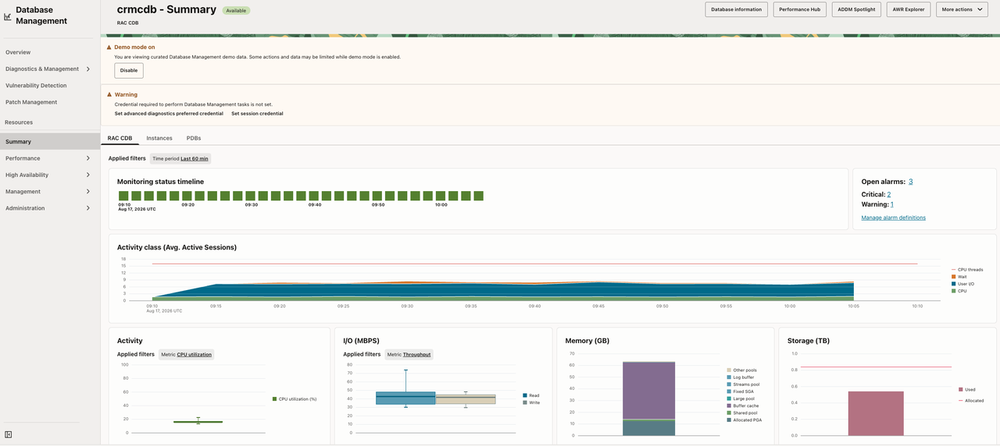
2. Review the monitoring charts for the selected time period.
3. Compare **Availability timeline**, **Activity Class**, **Activity**, **I/O**, **Memory**, and **Storage Usage**.
    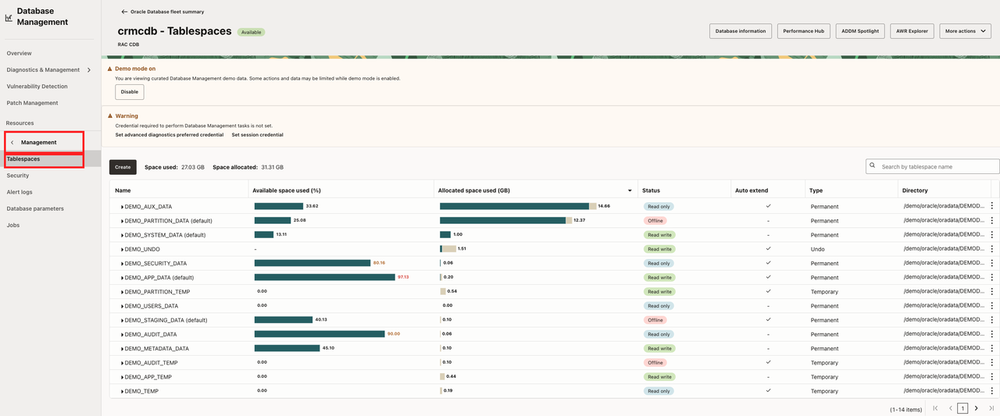
4. Note whether the signal is a short spike, a sustained trend, or an availability interruption.
5. If the target is a RAC CDB or PDB, verify the database level and member context before comparing metrics.
6. Explore **Tablespaces** and **Database Parameters** when those pages contain sample data. Do not assume a Demo Mode change will persist.
    

Record:

- Database and level: `[CDB, PDB, RAC, or other]`
- Leading signal: `[CPU, I/O, memory, storage, activity, availability, or other]`
- Time range: `[time range]`
- Supporting chart or alarm: `[evidence]`
- Initial hypothesis: `[workload/resource/availability/insufficient evidence]`

## Task 2: Use Performance Hub and SQL Monitoring

Performance Hub shows database activity across a selected period. SQL Monitoring adds execution-level details when a monitored statement is available.

1. On the managed database details page, select **Performance Hub**.
    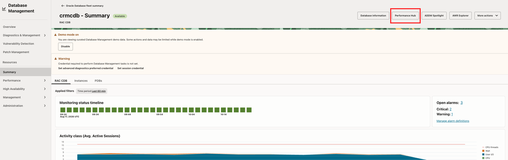
2. Set the time range to the period containing the signal.
3. Compare workload-sensitive charts, activity classes, and wait classes.
4. Use workload and session views to identify a high-impact SQL statement, wait class, or session pattern.
    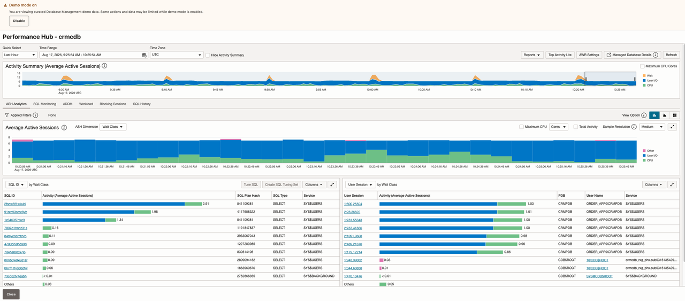
5. Open **SQL Monitoring**, when populated, and select a SQL ID.
    
6. Review execution duration, CPU, I/O, execution progress, and the execution plan.
    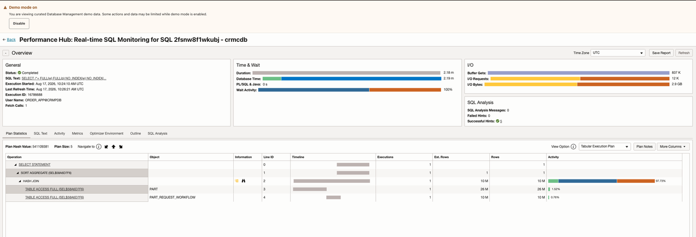
7. Compare plans when multiple plans are available.
8. Classify the evidence as CPU pressure, I/O pressure, wait-class concentration, plan change, recurring workload, or insufficient evidence.

Record:

- Leading signal or wait class: `[signal]`
- SQL ID, if available: `[SQL ID or N/A]`
- SQL Monitoring evidence: `[evidence]`
- Execution-plan observation: `[plan evidence]`
- Working diagnosis: `[diagnosis]`

## Task 3: Add Historical Context with AWR and ADDM

AWR Explorer extends the time horizon beyond a single current view. ADDM Spotlight aggregates findings and recommendations so you can distinguish chronic problems from intermittent spikes.

1. From the managed database details page, open **AWR Explorer**.
    
2. Set the time range around the observed signal.
3. Compare historical activity and waits with the current Performance Hub evidence.
    
4. Drill into a chart to inspect histogram wait-event details, when available.
5. Return to the database resource page and open **ADDM Spotlight**.
    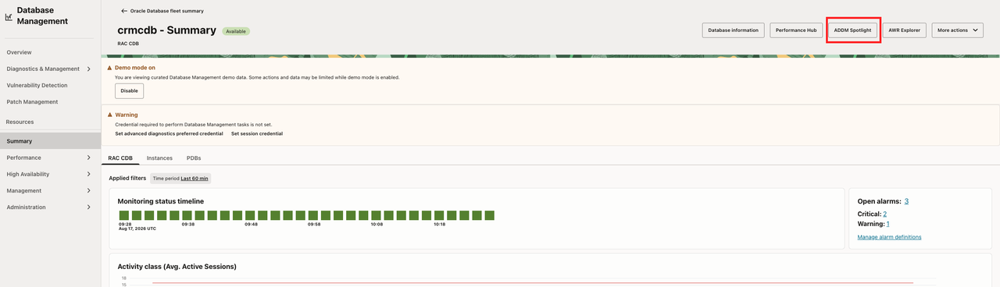
6. Review the database listing, findings count, overall impact, categories, and time-range filters.
7. Review the summary timeline and determine whether the finding or recommendation is recurring or intermittent.
8. Review **Findings** and **Recommendations**, comparing frequency, average active sessions, maximum impact, and recommendation benefit when available.
    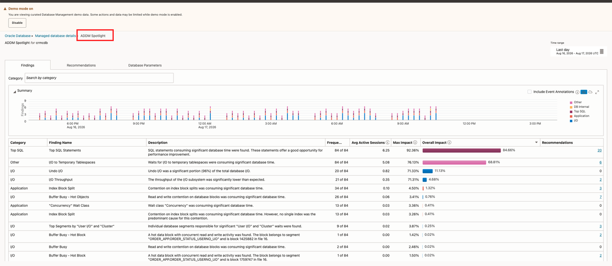
9. Review **Database Parameters** for high-impact parameters, reporting-period changes, ADDM-recommended changes, and non-default values.
10. Compare the highest-impact finding with the DBM diagnosis.

Record:

- Historical trend or wait: `[trend or N/A]`
- ADDM finding category: `[category or N/A]`
- Frequency or recurring pattern: `[frequency/pattern]`
- Average active sessions or impact: `[value/observation]`
- Maximum impact or recommendation benefit: `[value/observation]`
- Recommendation: `[recommendation or N/A]`
- Updated diagnosis: `[diagnosis]`

**Checkpoint:** Identify one historical finding or recommendation that adds context to the current database signal.

## Task 4: Analyze SQL Performance Across the Fleet

Ops Insights SQL Insights helps determine whether SQL degradation, plan changes, inefficiency, or resource consumption is isolated or repeated across databases and environments.

1. Open **Ops Insights → Overview**.
    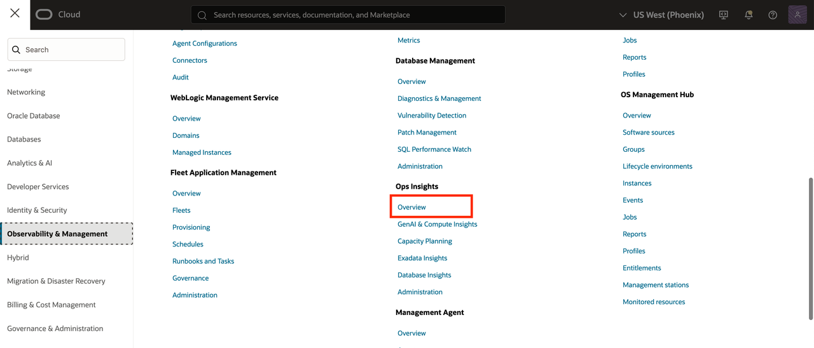
2. Select **Enable Demo Mode** and complete any displayed policy workflow.
    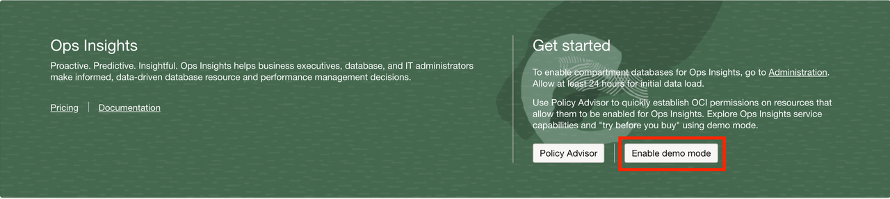
3. Confirm that the Ops Insights Demo Mode banner is visible.
    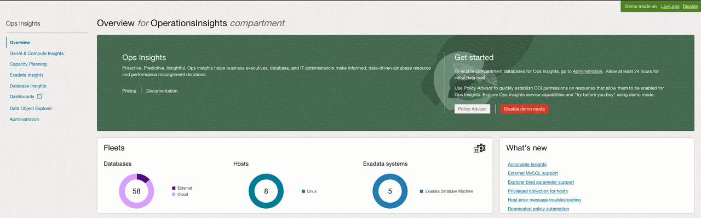
4. Open **Database Insights → SQL Insights → Fleet Analysis**.
    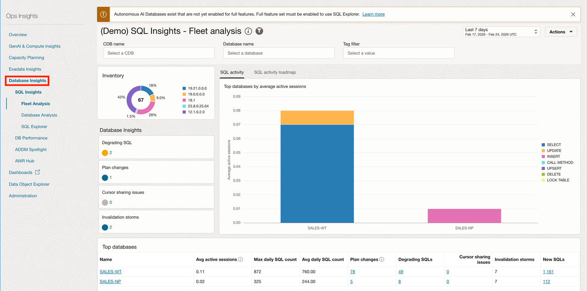
5. Review the SQL activity loadmap and the available insights for degrading SQL, unpredictable performance, inefficiency, changing execution plans, and top CPU or I/O usage.
    
6. Open database analysis for the selected database, when available.
    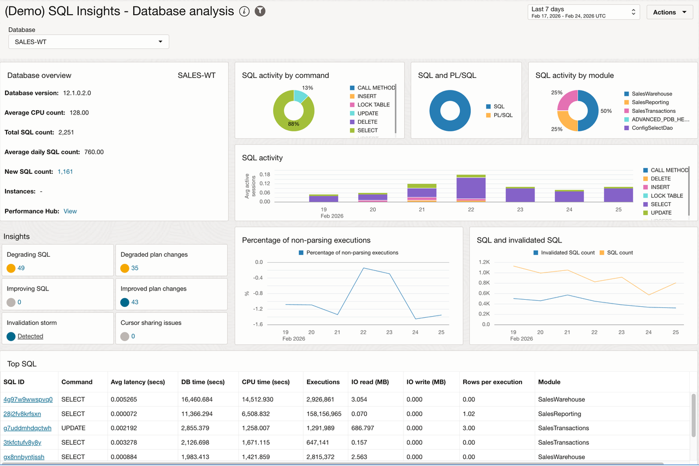
7. Open SQL analysis for the DBM SQL ID, when available. If it is not present, select a high-impact statement with a related performance pattern.
    
8. Review average latency, execution frequency, daily database time, I/O, plans, and resource usage.

Record:

- SQL Insights category: `[category]`
- Databases or environments affected: `[scope]`
- Plan or trend observation: `[observation]`
- Is the issue isolated or systemic? `[classification]`

## Learn More

- [ADDM Spotlight: Strategic advice to optimize Oracle Database performance](https://blogs.oracle.com/database/addm-spotlight-strategic-advice-optimize-oracle-dbms)

## Acknowledgements

* **Source approval** - The workshop author confirmed approval to use the provided source material for this build. Built with permission from the author(s).
* **Author** - Workshop owner to be assigned
* **Last Updated By/Date** - 2026-09-14
